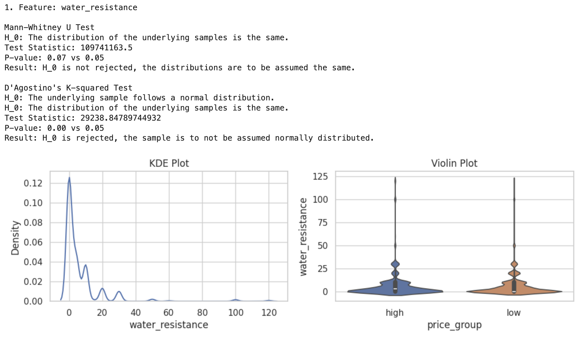
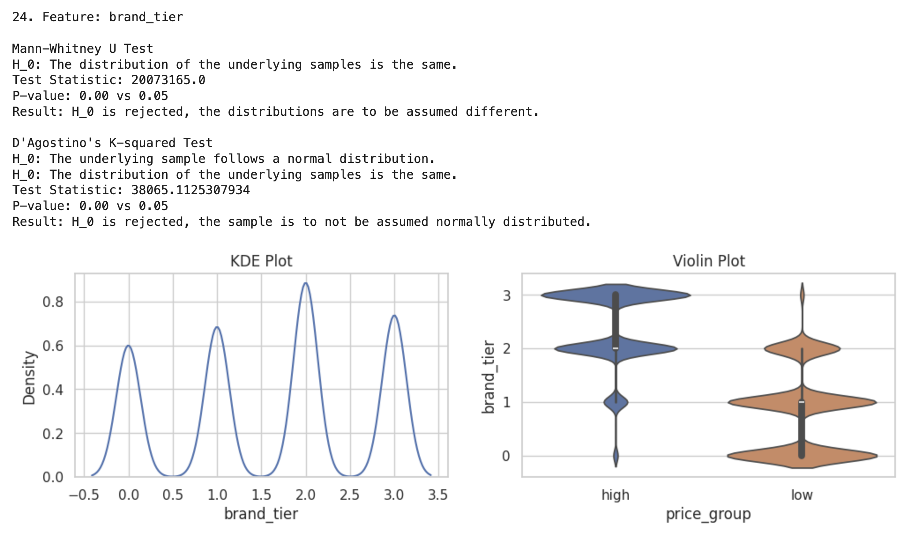
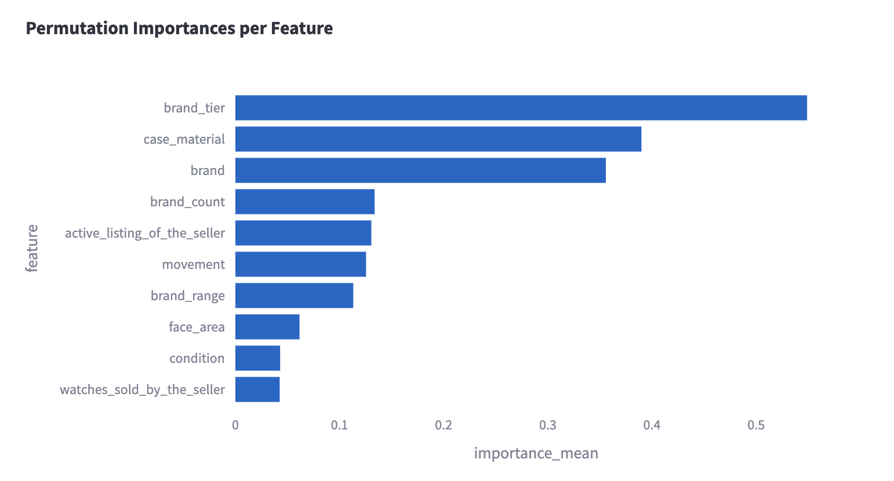
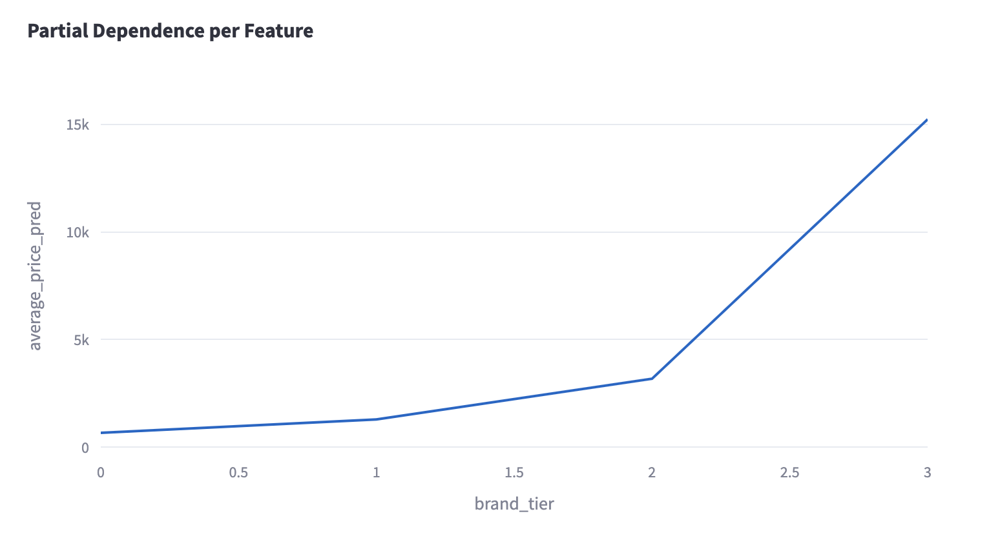
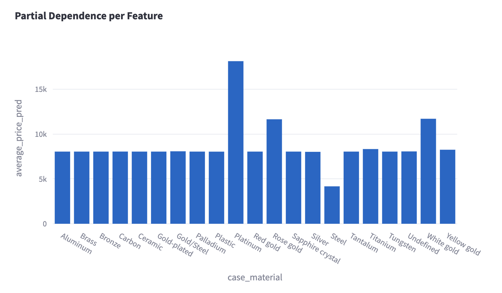
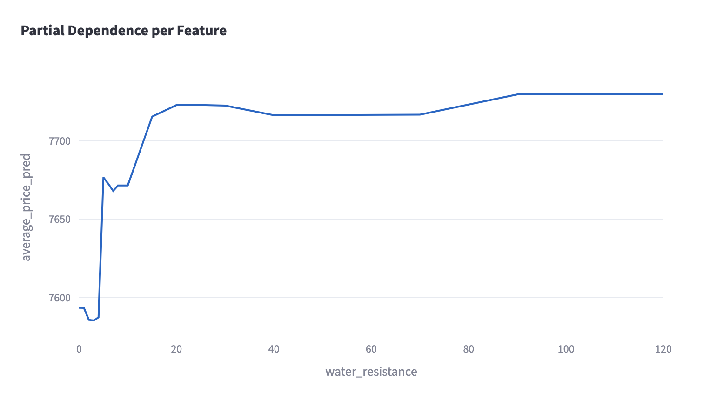

# Task 1. Statistical Analysis and Model Interpretation

## Introduction

This report summarizes the statistical analysis (EDA) and model interpretation for the Watch Pricing project. Model is trained on the dataset of real market data to predict prices for watch listings. The goal of this task is to:
- Evaluate feature significance using statistical tests.
- Build a predictive model and analyze global / local feature importances.

See full implementation in `fast-track.ipynb`. 

## Exploratory Data Analysis (EDA)

### Methodology

We divided samples into `low` and `high` price groups based on median price and applied:
- **Statistical Tests**:
  - **Mann-Whitney U Test**: Non-parametric test for distribution differences. It was chosen over other tests because it assumes no normality and scales well with sample size. Null hypothesis: The distribution of the underlying samples is the same.
  - **D’Agostino’s K² Test**: Checks normality of feature distributions. It was chosen over other tests because it works properly with large sample size. Null hypothesis: The underlying sample follows a normal distribution.
- **Visualization**: KDE and violin plots for distribution visualization and comparisons between groups.

### Key Findings

Among 30+ features present in the dataset, only one feature did not reject the Mann-Whitney U Test (p > 0.05) and showed insignificant differences between price groups: `water_resistant`. All other features showed significant difference and rejected D’Agostino’s K² Test for normality.

Results are not surprising due to the fact that the dataset is collected from real market listings. Following on, the features are assumed to be non-normal and differ between price groups. Therefore, non-linear models are expected to perform better than linear ones.  

## Model Interpretation

### Model

Based on EDA findings, we used a Decision Tree Regressor (non-linear model) with the following interpretation methods:
- **Global Importance**: Permutation importance (`sklearn.inspection.permutation_importance`).
- **Local Dependence**: Partial dependence (`sklearn.inspection.partial_dependence`).

### Results

#### Global Importance

Only 3 features are above 0.2 cutoff in permutation importance: brand_tier, case_material and brand. This outcome is expected watch prices are commonly defined by brand or materials. Mid-level importances are observed for type of watch movement and reseller's activity. Most out of 30+ features are almost insignificant according to permutation importance and may not influence watch prices at all.

#### Local Dependence 

Each feature has a unique partial dependence plot, let's look at some of them:
- **`brand_tier`**: Ordinal feature with an evidently strong influence on price. Higher values correlate with higher prices. 
- **`case_material`**: Categorical feature with prominent price groups. Most materials have base level prices, but steel is associated with significantly cheaper watches, while platinum and some variations of gold are very expensive.
- **`water_resistance`**: A less influential continuous feature with a non-linear effect. Watches with little to no resistance are noticeably cheaper, but any resistance above 20 is associated with the same price level. So, this feature could potentially be binarized as low and high resistance without much information loss.
